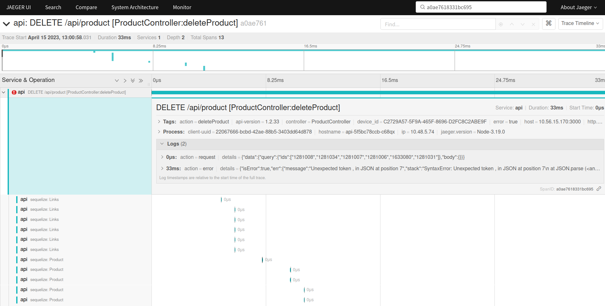

# Putting out fires and monitoring services using Jaeger Tracing, Kibana and Grafana

### What is it, what problems does it solve, and who would benefit from it ?

1. **You're a backend developer**:
- Tired of wading through a huge stack of logs to find out what's wrong ?
- You have a bug that won't reproduce and you want to know what exactly happened to a particular user with specific data?
- Do you have a microservice architecture and would like to visualize who is calling whom and what is being sent to whom?

2. **You are a tester**:
- Would you like to simplify the process of testing APIs and get more information about what went wrong?
- Would you like to simplify writing a huge bug report with lots of data and just specify the request ID?

3. **You're a PM**:
- Would you like to know about crashed productions or mass errors before a customer notifies you ?
- Would you like to be notified via slack, telegram, whatsapp if something goes wrong ?
- Would you like to have clear visualization of what's going on in your application ?

4. **You're a customer**.
- Would you like to see statistics for any of the features?
- Do you want to know at what time most users are using your app, and what they are doing ?

#### How would the solution to your problems look like ?
Let's imagine the following scenario: you are doing your business on Saturday and then, for some reason
the server goes down.
In normal life you would go on with your business and your client would find out 2 days later that
it was bad, and that it had been that bad for 2 days, and would fire everyone for negligence.

### But now:
### 1. You get an instant notification from Grafana in slack, telegram or whatsapp:

### 2. You immediately go to Grafana (via the link in the message) and see what happened there:

Just in case, you look at the other dashboards and see that there were service restarts as well, and the crashes have been repeated several times.

In the API latest errors list in Grafana, you copy traceID to then find out more details in Kibana.

### 3. In Kibana, you type traceID in search and get detailed information about the error:

### 4. Just in case, go to Kibana's dashboard and realize that there have been many such errors:
You can see which handpoints, which users called, and how many total errors there were.

Well it's time to piss off the developers (or yourself) and try to solve this problem.
The easiest thing to do is to send them a traceID that they can easily find everything they need.

### 5. The developer (or you) goes into Jaeger and types traceID into the search:
There he sees all the details of the request, which user, what was requested, and what specific functions were called.

In this case, the error is simple enough, and not

Translated with www.DeepL.com/Translator (free version)